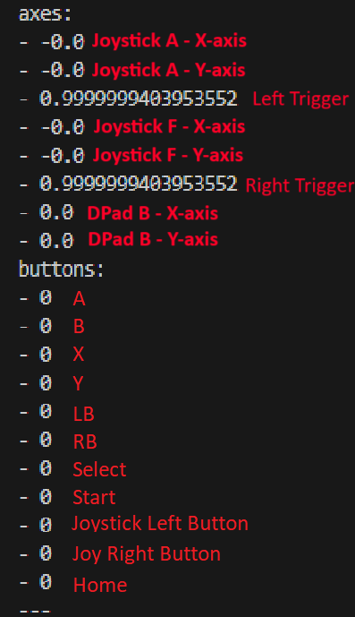
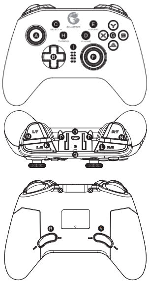
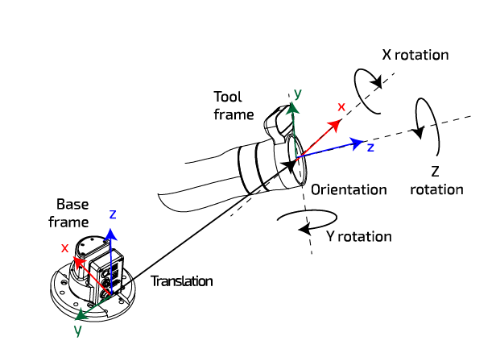

teleop_twist_joy
================

# Overview
The purpose of this package is to provide the specific facility for tele-operating Reindeere's Dasher ROS2 robot with a standard joystick. The robot consists of a differential drive base and a 7 DOF robotic arm from Kinova (Gen 3 - 7DOF).
This package converts joy messages to velocity and controller preset commands for both the base and arm.

An illustration of the controller and button mapping can be found below and it's configuration in the config folder. The images below are based on the GameSir joystick controller(and the `gamesirT4pro.config.yaml` config file).


## Key Binding of GameSir to "joy" topic
<figure align="center">
  
</figure>


## Default teleop control scheme
<figure align="center">
  
  <figcaption>Key Labels of <a href="https://cdn.shopify.com/s/files/1/2241/8433/files/T4_Pro_T4_Pro_SE_User_Manual.pdf?v=1676270926">GameSir T4Pro controller</a></figcaption>
</figure> 

<style>
  th {
    text-align: center;
  }
</style>
<table align="center">
<tr><th>BASE Control</th><th>ARM Control</th></tr>
<tr vertical-align:top><td valign="top">

Key Label | Function
---|---
L "RB" | Activate E-Stop 
K "LB" | Deactivate E-Stop 
D "Home" | Toggle between the Arm & Base Control
B [UP] | *Increase* the Max Linear and Angular Speeds
B [DOWN] | *Decrease* the Max Linear and Angular Speeds
 | 
A [UP] | Move Forward 
A [DOWN] | Move Backwards
F [LEFT] | Turn Left
F [RIGHT] | Turn Right

</td><td valign="top">

Key Label | Function
---|---
L "RB" | Activate E-Stop 
K "LB" | Deactivate E-Stop 
D "Home" | Toggle between the Arm & Base Control
B [UP] | *Increase* the Max Linear and Angular Speeds
B [DOWN] | *Decrease* the Max Linear and Angular Speeds
 | 
N "RT" | Open the Gripper 
M "LT" | Close the Gripper 
[Coordinate Sys] |  
A [BUTTON] | Toggle between End-Effector (EE) Translation (X & Y) & Rotation (X & Z)
F [BUTTON] | Toggle between End-Effector (EE) Translation (Z) & Rotation (Y)
 | 
A [UP] | + X Translation [Forward] 
A [DOWN] | - X Translation [Backward]
A [LEFT] | + Y Translation [Left] 
A [RIGHT] | - Y Translation [Right]
F [UP] | + Z Translation [Up] 
F [DOWN] | - Z Translation [Down]
 | 
A [UP] (with button toggled) | + X Rotation [Pitch Up] 
A [DOWN] (with button toggled) | - X Rotation [Pitch Down]
A [LEFT] (with button toggled) | + Z Rotation [Roll Left] 
A [RIGHT] (with button toggled) | - Z Rotation [Roll Right]
F [LEFT] (with button toggled) | + Y Rotation [Yaw Left] 
F [RIGHT] (with button toggled) | - Y Rotation [Yaw Right]
 | 
C "Select" | Toggle between twist controller and Joint controller (used for position presets)
E "Start" | Toggle between preset layers. There are 2 layers of pose presets for the ABXY buttons.
G "A,B,X,Y" | Preset Selectors. Each button is mapped to a preset pose.


</td></tr> </table>

This node provides no rate limiting or autorepeat functionality. It is expected that you take advantage of the features built into [joy](https://index.ros.org/p/joy/github-ros-drivers-joystick_drivers/#foxy) for this.

## Executables
The package comes with the `teleop_node` that republishes `sensor_msgs/msg/Joy` messages as scaled `geometry_msgs/msg/Twist` messages.

## Subscribed Topics
- `joy (sensor_msgs/msg/Joy)`
  - Joystick messages to be translated to velocity commands.

## Published Topics
- `cmd_vel_arm (geometry_msgs/msg/Twist)`
  - Command velocity messages for the ARM arising from Joystick commands.
- `cmd_vel_base (geometry_msgs/msg/Twist)`
  - Command velocity messages for the BASE arising from Joystick commands.

## Parameters
`<device> = "arm" or "base"`
- `<device>_axis_linear.<axis>`
  - Joystick axis used for linear movement control.
  - `<device>_axis_linear.x (int, default: see config file)`
  - `<device>_axis_linear.y (int, default: see config file)`
  - `<device>_axis_linear.z (int, default: see config file)`

- `<device>_scale_linear.<axis>`
  - Scale to apply to joystick linear axis for speed movement.
  - `<device>_scale_linear.x (double, default: see config file)`
  - `<device>_scale_linear.y (double, default: see config file)`
  - `<device>_scale_linear.z (double, default: see config file)`

- `<device>_axis_angular.<axis>`
  - Joystick axis used for angular movement control.
  - `<device>_axis_angular.yaw (int, default: see config file)`
  - `<device>_axis_angular.pitch (int, default: see config file)`
  - `<device>_axis_angular.roll (int, default: see config file)`
  
- `<device>_scale_angular.<axis>`
  - Scale to apply to joystick angular axis.
  - `<device>_scale_angular.yaw (double, default: see config file)`
  - `<device>_scale_angular.pitch (double, default: see config file)`
  - `<device>_scale_angular.roll (double, default: see config file)`

- `arm_preset_buttons.<presetName> (int, default: see config file)`
  - Joystick button used to request a preset.
  - e.g. 
    - `arm_preset_buttons.retract (int, default: see config file)`
    - `arm_preset_buttons.home (int, default: see config file)`
  
- `arm_preset_pos.<presetName> (double, default: see config file)`
  - Preset positions in Joint positions (degrees)

- `estop_activated (bool, default: see config file)`
  - Flag to identify whether the estop is active
- `activate_estop_button (int, default: see config file)`
  - Joystick button used to activate the E-Stop.
- `deactivate_estop_button (int, default: see config file)`
  - Joystick button used to deactivate the E-Stop.
- `jog_arm_button (int, default: see config file)`
  - Joystick button used to toggle between teleoperating the arm or base.
- `arm_jogged (bool, default: see config file)`
  - Flag to identify whether user is teleoperating the arm or base.
- `XYTwist_toggle (int, default: see config file)`
  - Joystick button used to toggle between translation and rotation of X & Y axes.
- `ZTwist_toggle (int, default: see config file)`
  - Joystick button used to toggle between translation and rotation of Z axis.
- `arm_maxPresetDuration (int, default: see config file)`
  - Duration for the max allowable runtime of the arm preset. Helps determine how quickly to reach preset pose.
- `toggle_preset_layer_button (int, default: see config file)`
  - Joystick button used to toggle between the 2 preset layers on the ABXY buttons.
- `toggle_control_mode_button (int, default: see config file)`
  - Joystick button used to toggle between twist and joint controllers.
- `speed_changer_dpad (int, default: see config file)`
  - Joystick axis used for changing the manimum speed of all twist components. Only changes speed for the device being controlled (Arm or Base, not both simultaneously).
  


# Usage

## Install
Clone this repo into the `src` folder in your workspace.
```sh
mkdir -p ~/ros2_ws/src
cd ~/ros2_ws/src
```
```sh
git clone https://github.com/reindeererobotics/teleop_twist_joy.git
```
Build the package
```sh
colcon build
```

## Run
A launch file has been provided which has three arguments which can be changed in the terminal or via your own launch file.
To configure the node to match your joystick a config file should be used. 
There are several common ones provided in this package (atk3, ps3-holonomic, ps3, xbox, xd3), located here: https://github.com/ros2/teleop_twist_joy/tree/eloquent/config. However, similar configurations performed in the "gamesirT4pro" file should be applied to the configuration file of the new joystick controller.

GameSir T4pro is the default, to run for another config (e.g. xbox) use this:
````
ros2 launch teleop_twist_joy teleop-launch.py joy_config:='xbox'
````
otherwise use this:
```sh
ros2 launch teleop_twist_joy teleop-launch.py
```

__Note:__ this launch file also launches the `joy` node so do not run it separately.


## Arguments
- `joy_config (string, default: 'ps3')`
  - Config file to use
- `joy_dev (string, default: 'dev/input/js0')`
  - Joystick device to use
-  `joy_vel_arm (string, default: 'cmd_vel_arm')`
     - Published topic for the ARM's twist message
-  `joy_vel_base (string, default: 'cmd_vel_base')`
    - Published topic for the BASE's twist message
- `config_filepath (string, default: './config/' + LaunchConfig('joy_config') + '.config.yaml')`
  - Path to config files
